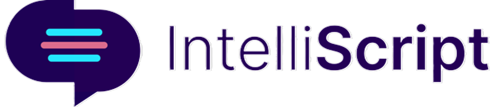
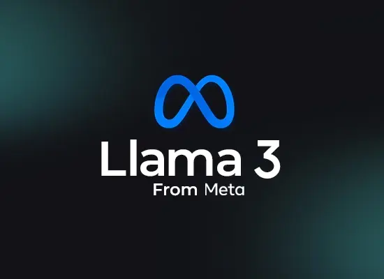

# IntelliScript

### Your data, in your own hands, powered by Meta Llama-3 8B Model

A personal AI partner for your company to extract insights and streamline decision-making based on your company’s knowledge base.

Key features:

- Natural Language Q & A
- Instant Report Drafting
- Business Insights
- Handle Multiple Data Types

Web site: https://intelliscript.carelweb.org/

---

LLM Model: **_meta-llama/Meta-Llama-3-8B-Instruct_**

In this implementation, we used _meta-llama/Meta-Llama-3-8B-Instruct_ model as the backbone LLM. The model is directly loaded from the HuggingFace and 4-bit quantization is used to reduce the resource consumption.

---

Embedding Model: **_sentence-transformers/all-MiniLM-L6-v2_**

---

[app.py](app.py) - handle the API endpoint functionalities
[intelliscript.py](intelliscript.py) - handle the main functionality of the application
